# Презентация проекта "RS App Clone"

---

## 1. Введение

### Наша команда

- **Олег** - тимлид проекта
- **Алексей**
- **Екатерина**

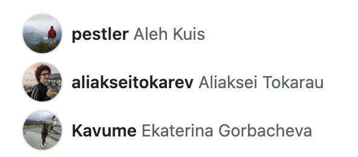

### Описание проекта

**RS App Clone** — это фронтенд-часть учебного приложения, разработанная на Angular. Проект эмулирует ключевые функции платформы для студентов и менторов, включая аутентификацию, управление курсами, просмотр успеваемости и взаимодействие между пользователями.

**Цель проекта:** Создать современное, производительное и масштабируемое веб-приложение, используя новейшие возможности фреймворка Angular и лучшие практики разработки.

### Работа с задачами (Issues)

- разбить проект на небольшие управляемые задачи;
- вести прозрачный бэклог;
- отслеживать прогресс выполнения каждой задачи;
- обсуждать детали реализации прямо в комментариях к задаче.

    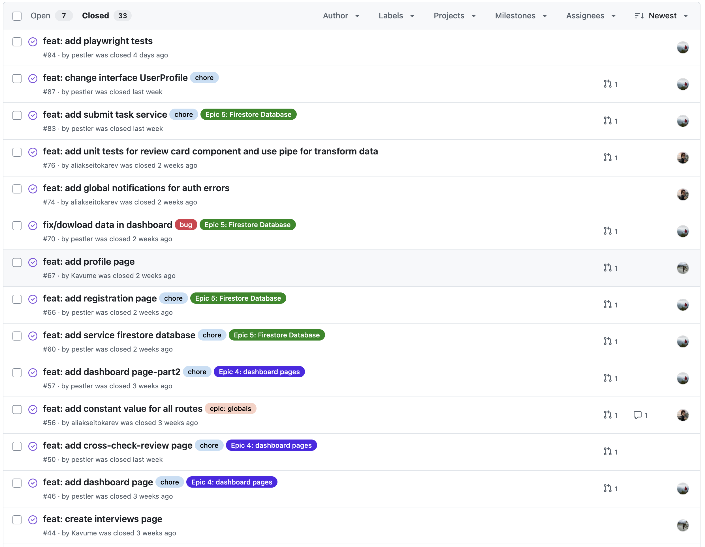
    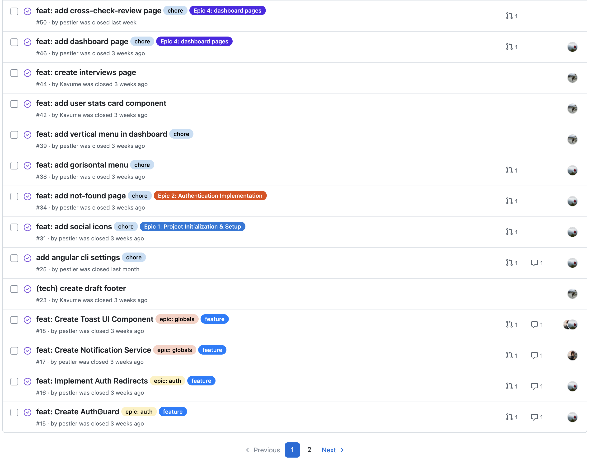

---

### Работа с Pull Requests

Каждая новая функциональность или исправление проходили через **Pull Request**. Мы:

- создавали ветки под конкретные задачи;

    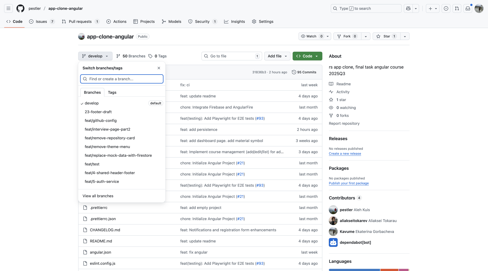
    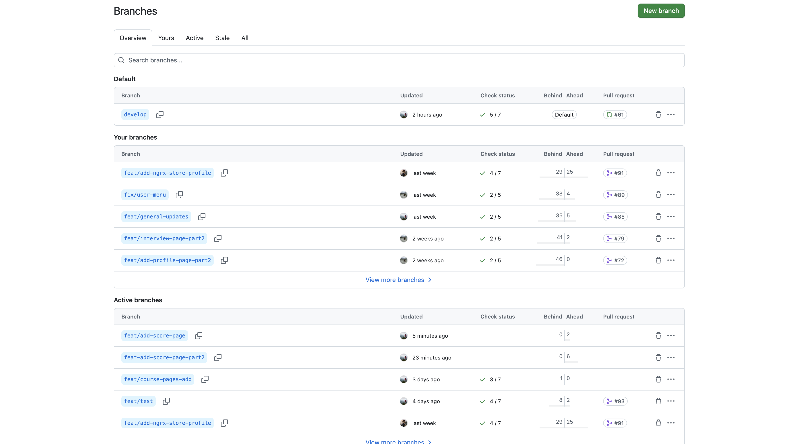

- открывали Pull Request с описанием изменений;
- проводили код-ревью и обсуждение решений;

    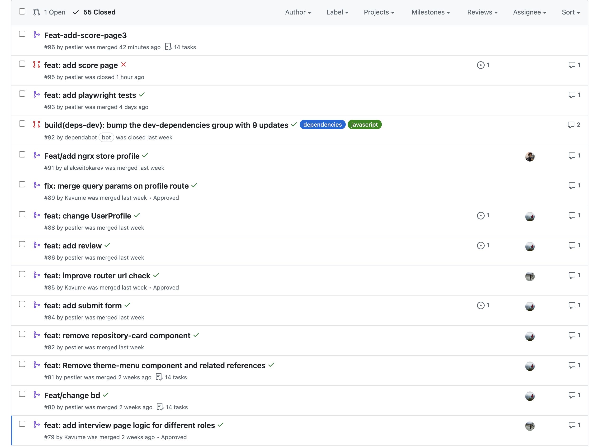
    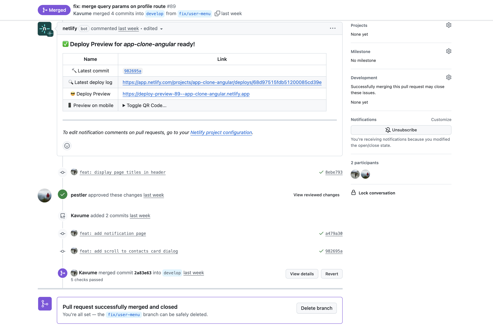

---

## 2. Обзор проекта

### Техническое задание

Основной задачей была реализация клиентской части приложения со следующими ключевыми требованиями:

- **Современный Angular:** Использование Signals для управления состоянием, новый синтаксис в шаблонах.
- **Эффективная навигация:** Реализация ленивой загрузки модулей (Lazy Loading) и защита роутов с помощью Guards.
- **Строгая типизация:** Применение Strict TypeScript для повышения надежности и уменьшения ошибок.
- **Качество кода:** Покрытие кода юнит-тестами и E2E-тестами.

### Архитектура приложения

Приложение построено на модульной архитектуре с четким разделением ответственности:

- `src/app/core`: Ядро приложения — сервисы, модели данных, логика взаимодействия с API.
- `src/app/pages`: Компоненты страниц, соответствующие основным маршрутам.
- `src/app/layout`: Общие компоненты интерфейса (шапка, подвал, навигация).
- `src/app/shared`: Переиспользуемые компоненты, пайпы и директивы.

  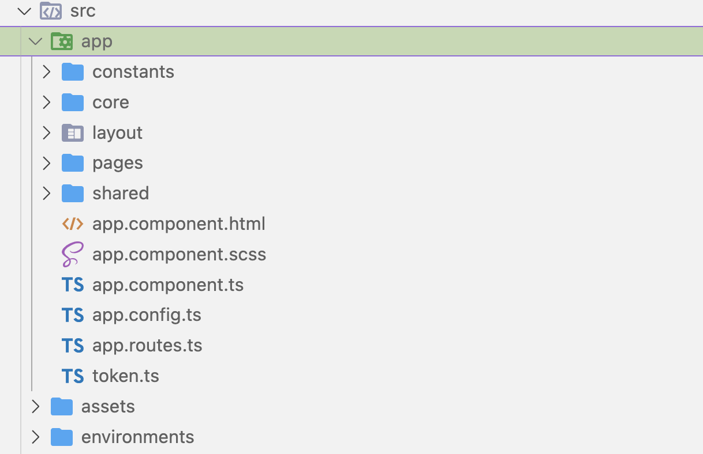

В качестве бэкенда используется **Firebase Firestore**, что обеспечивает гибкость и быстроту разработки.

  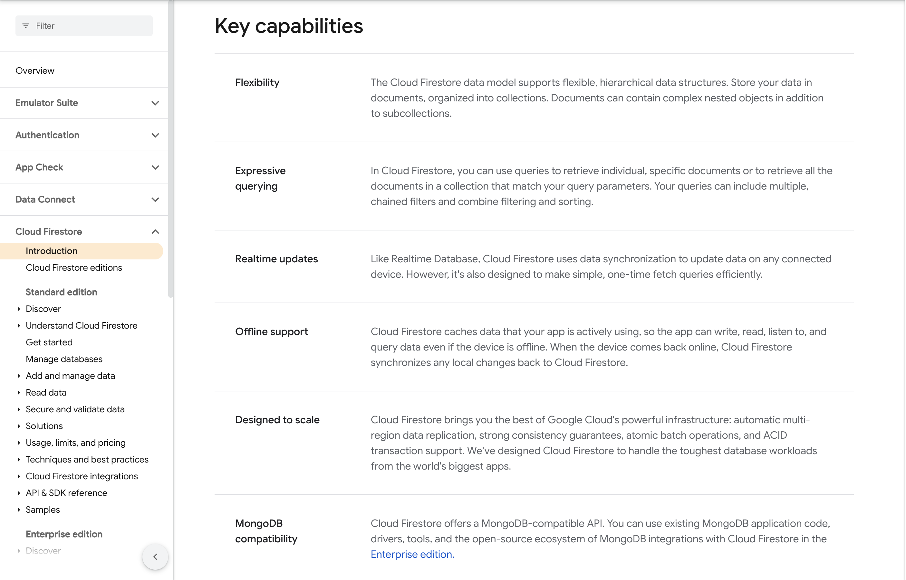

---

## 3. Демонстрация функционала

Приложение предоставляет следующий основной функционал:

- **Аутентификация и роли:** Регистрация и вход через GitHub, выбор роли (студент, ментор).

  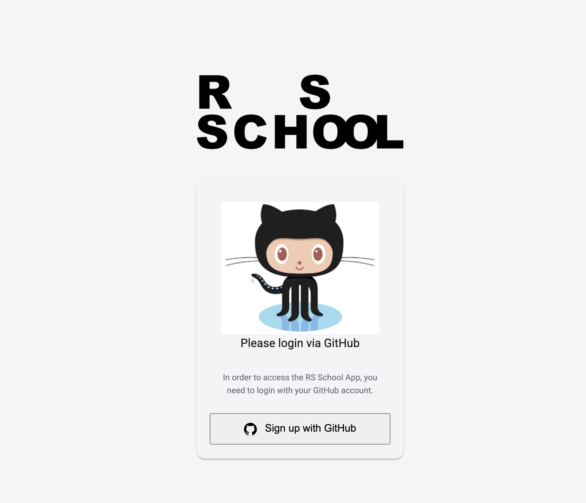
  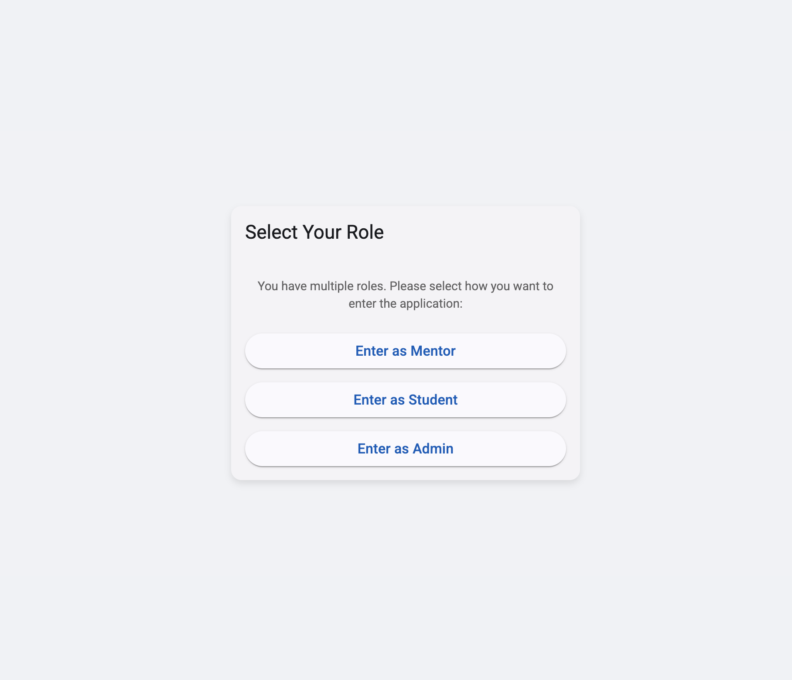

- **Дашборд студента:** Просмотр успеваемости, статуса заданий, прогресса по курсу.
- **Дашборды ментора и админа:** Инструменты для управления студентами и курсами.
- **Профиль пользователя:** Редактирование личной информации.

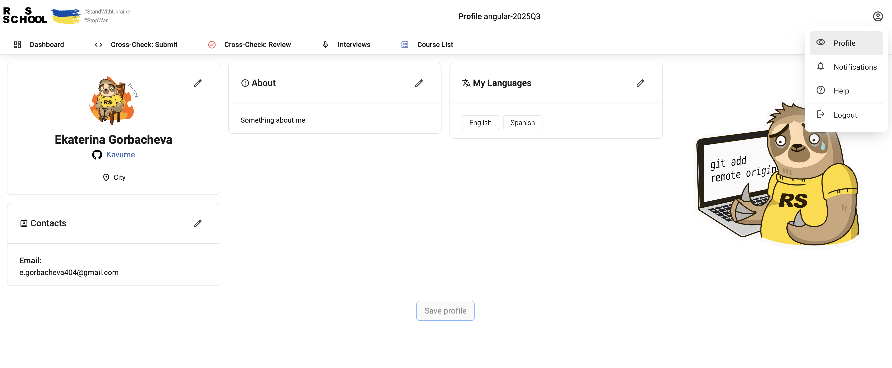

- **Система уведомлений:** Оповещения о важных событиях.

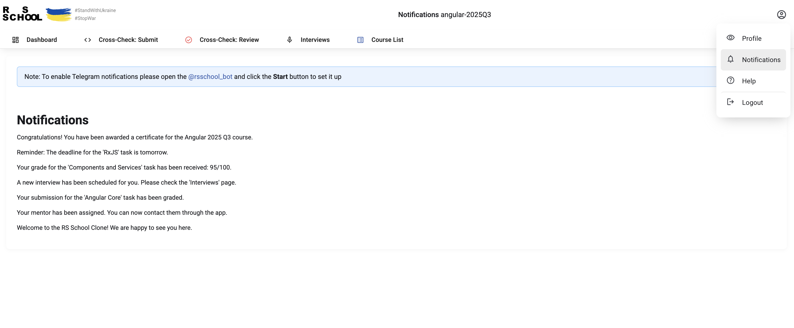

- **Cross-Check:** Функционал для проверки заданий другими студентами (отправка и рецензирование).

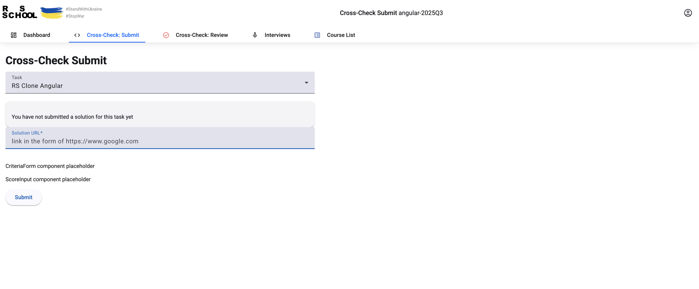

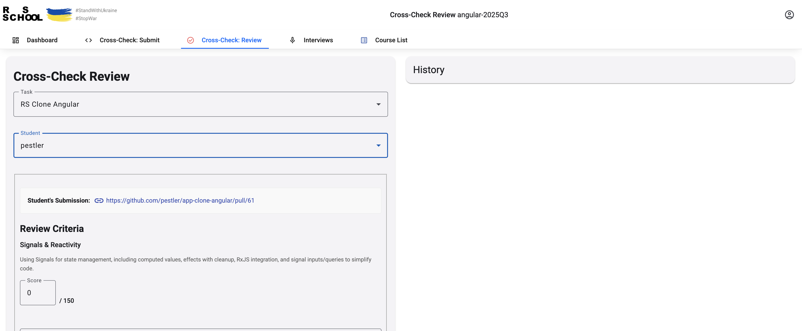

- **Администрирование курсов:** Создание и редактирование учебных курсов.
  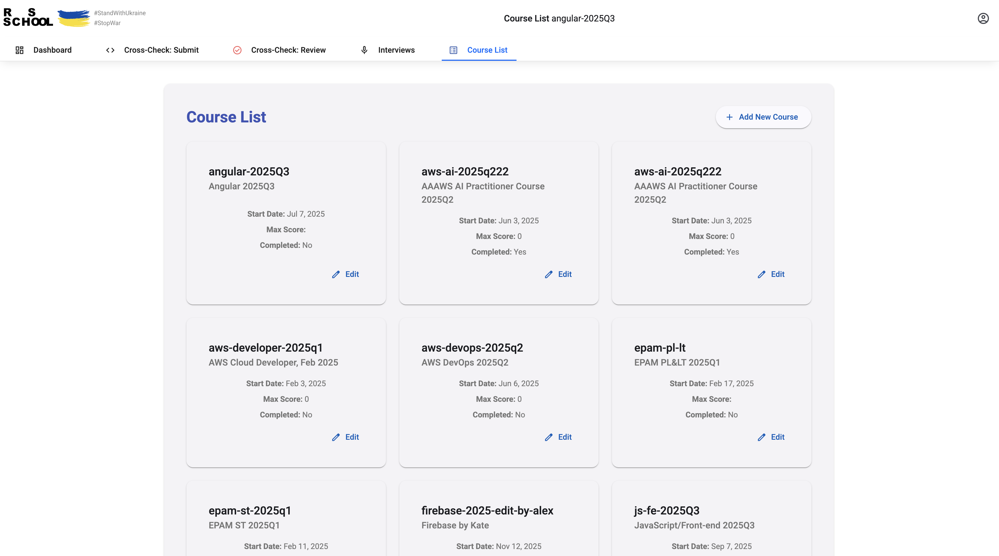

---

## 4. Технические детали

### Стек технологий

- **Фреймворк:** Angular 20
- **Управление состоянием:** Angular Signals, RxJS, NgRx
- **Бэкенд и аутентификация:** Firebase (Firestore, Firebase Auth)
- **UI компоненты:** Angular Material
- **Тестирование:**
  - Unit-тесты: Jasmine, Karma
  - E2E-тесты: Playwright
- **Качество кода:** ESLint, Prettier, Stylelint

### Управление состоянием

Мы применили гибридный подход:

- **Angular Signals:** Используются для управления локальным состоянием компонентов, что упрощает код и повышает производительность благодаря гранулярному обновлению DOM.
- **RxJS:** Применяется для работы со сложными асинхронными операциями и потоками данных, например, при взаимодействии с API.

  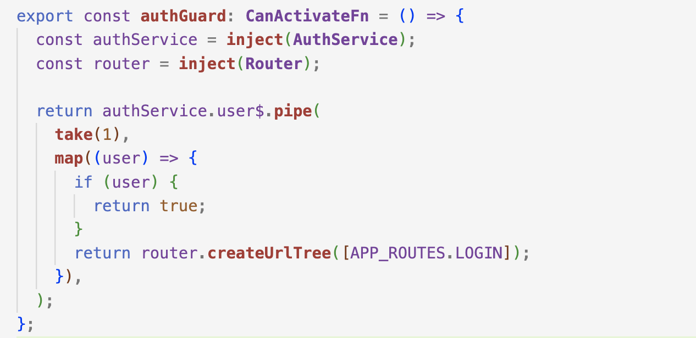

- **NgRx:** Используется для глобального управления состоянием, где это необходимо для сложных сценариев.

  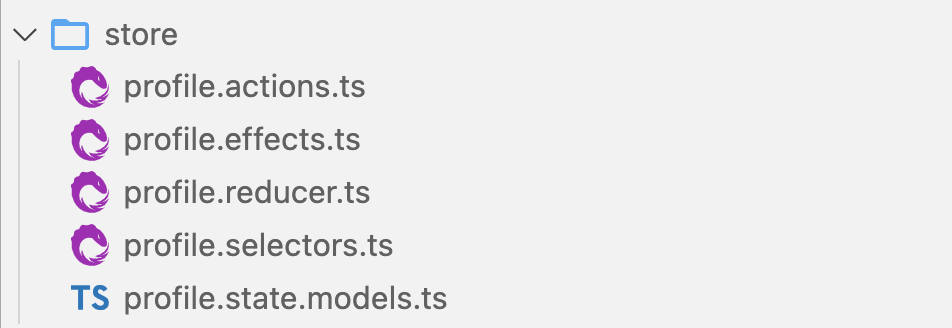

### Взаимодействие с API (Firestore)

Для работы с Firestore реализован сервисный слой:

- **`FirestoreService`:** Предоставляет универсальные методы для доступа к коллекциям и документам.
- **`FirestoreDataConverter`:** Используется для строгой типизации данных при обмене между TypeScript-моделями и Firestore, что исключает ошибки типов и делает код более предсказуемым.
- Доменные сервисы (`AuthService`, `CourseService`) инкапсулируют логику конкретных бизнес-сущностей.

---

## 5. Проблемы и решения

### Основная трудность: Работа с бэкендом

**Проблема:** Одной из главных трудностей стала интеграция с бэкендом на Firestore. Возникали сложности с правильной организацией асинхронных потоков данных, обеспечением строгой типизации и обработкой ответов от базы данных в реальном времени.

**Решение:**

1.  **Создание сервисного слоя:** Мы разработали четкую структуру сервисов, где каждый сервис отвечает за свою часть данных (пользователи, курсы).
2.  **Применение `FirestoreDataConverter`:** Это позволило нам "на лету" преобразовывать данные из Firestore в наши TypeScript-модели и обратно, обеспечив полную типизацию и безопасность.
3.  **Использование RxJS:** Для управления сложными цепочками асинхронных запросов мы активно использовали операторы RxJS, что сделало код более читаемым и управляемым.

---

## 6. Заключение

В ходе проекта мы успешно создали полнофункциональное фронтенд-приложение, отвечающее современным стандартам веб-разработки.

### Полученные навыки:

- Глубокое понимание и практическое применение **Angular Signals**.
- Опыт работы с **Firebase** как с полноценным бэкендом.
- Навыки построения сложной архитектуры приложений на Angular.
- Практика в написании и поддержке **юнит и E2E тестов**.
- Опыт командной работы, настройки CI/CD и использования Git.

**Спасибо за внимание! Готовы ответить на ваши вопросы.**
